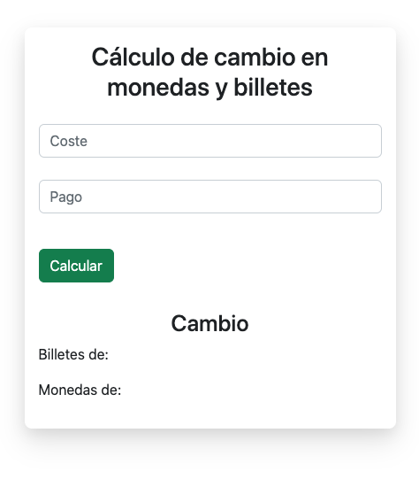
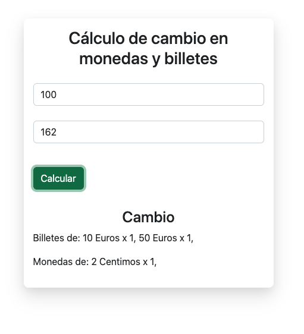

# Money change calculator

This javascript exercise calculates the change to be returned depending on the cost and the amount of money with which it is paid.

There are two empty inputs, in the first one the cost is written and in the second one the payment. 

Finally there is a button that performs the calculation and shows the amount of bills and coins needed to give the change.

The existing bills are: 5, 10, 20, 50, 100, 200.
Existing coins are: 0.1, 0.2, 0.5, 1, 2.

